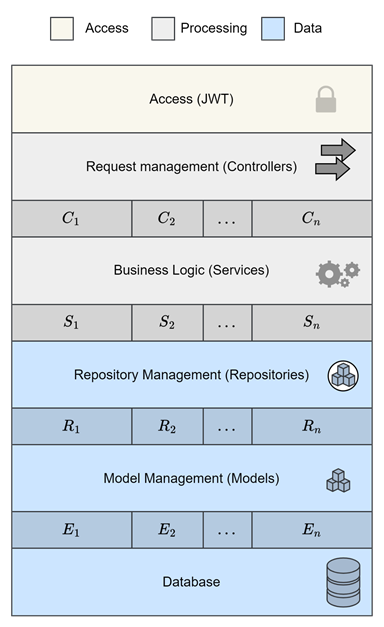

<p align="center">  </p> <div align="center"> <a href="https://test.pypi.org/project/mictlanx/"></a> </div> <div align="center"> <h1>Axo: <span style="font-weight:normal;">Backend</span></h1> </div>                                   


The Axo Backend is the core system for a platform designed to allow users to manage active objects dynamically and efficiently. This backend service provides comprehensive REST API to handle all business logic, and database interactions related to active object creation, modification, and retrieval.

---

## 🛠️ Architecture

The following diagram represents the architecture of the backend system:

<p align="center">
    
</p>

This architecture ensures a clear separation of concerns:
- **Access Layer**: Handles authentication and authorization (e.g., JWT).
- **Controllers Layer**: Routes requests to the appropriate services.
- **Services Layer**: Implements core business logic.
- **Repositories Layer**: Manages database interactions.
- **Models Layer**: Defines data structures and database relationships.

---

## 🗂️ Project Structure

The project is organized as follows:

- **axobackend/**
  - `controllers/` - Contains the request routing logic.
  - `models/` - Database models and relationships.
  - `services/` - Contains reusable functions and core logic.
  - `repositories/` - Handles database queries.
  - `security/` - Includes authentication and authorization mechanisms.
  - `utils/` - Provides helper utilities.
  - `main.py` - Entry point of the application.
- **tests/** - Unit tests.
- **db/** - Scripts and configuration for database setup.
- `run.sh` - Start-up script.

---

## ⚙️ Prerequisites
Make sure you have the following installed:
- **Python 3.10+**
- **Poetry (for dependency management)**
- **Docker** and **Docker Compose** (to deploy MongoDB)

---

## 🚀 Installation

### Step 1: Clone the repository

```bash
git clone https://github.com/fatimacm/axo-backend.git
cd axo-backend
```
### Step 2: Deploy the MongoDB cluster
```bash
docker compose -f ./db_cluster.yml up -d
```

Execute the next command in the mongo1 container: 

```bash
mongosh
```

Then, copy the contents of init_repset.sh into the MongoDB command line to initialize the replica set.

### Step 3: Install dependencies

```bash
poetry lock 
poetry install
poetry shell
```
---

## ▶️ Usage

### Run development server:

```bash
./run.sh
```
The backend will be available on port 17000. You can now send API requests to perform CRUD operations.

---

## 🧪 Testing 
To validate the functionality of the backend, use the **unittest** framework:

### Run unit tests

```bash
python -m unittest discover -s ./tests -p "users_test.py"
```
All tests should pass if the setup was done correctly.

---

## 📄 Documentation

The project includes detailed API documentation accessible via the FastAPI auto-generated interface.

### Access the API docs

1. Start the backend server.
2. Open a browser and navigate to:

    - Swagger UI: http://localhost:17000/docs
    - ReDoc: http://localhost:17000/redoc

---

## 💬 Contributing
Pull requests are welcome! For major changes, please open an issue first to discuss what you'd like to propose. ❤️

